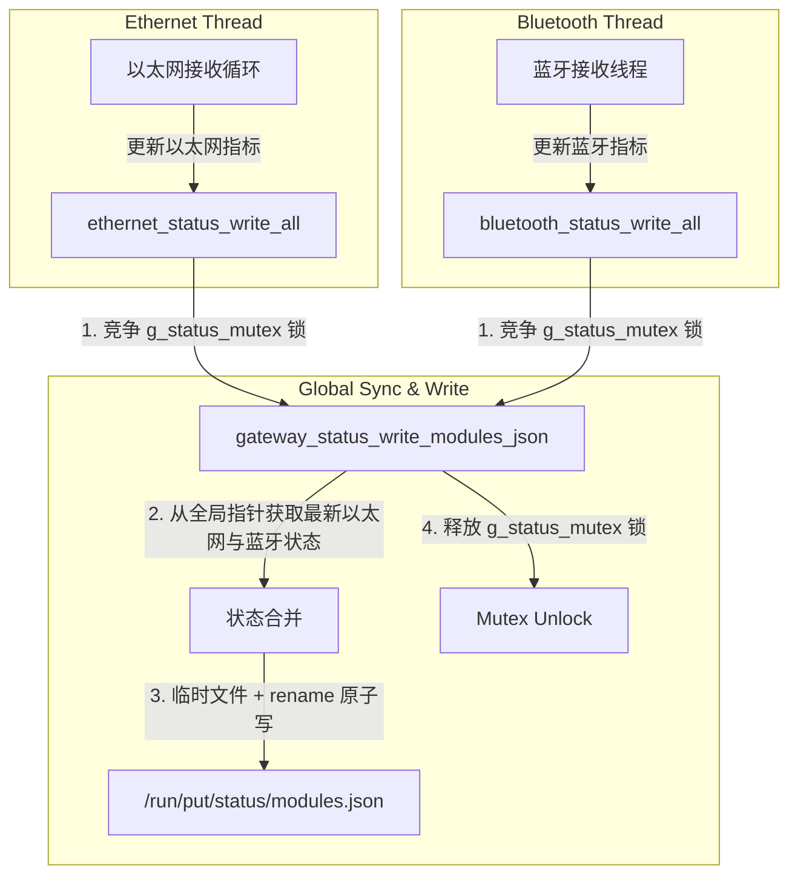

# 蓝牙模块设计说明书

## 1. 模块定位与背景

在多协议网关项目中，大核 Linux 侧（基于 Milk-V Duo 256M 平台）除了负责高速的以太网 UDP 调试帧通信外，还需要接入**经典蓝牙 SPP (Serial Port Profile)** 通信模块。该模块作为网关的无线本地调试与车辆控制入口，允许手机 App 或手持调试设备通过经典蓝牙配对，向网关发送控制指令，进而转换为 CAN/CAN FD 总线帧下发到车辆网络。

### 1.1 设计目标
1. **高性能与实时性**：采用多线程（Pthread）异步架构，蓝牙接收与解析独立运行，不阻塞以太网主线程或系统的其他核心流程。
2. **高可靠性**：支持断线自动重连，具备强大的数据帧边界校验（CRC-16 校验与 DLC 过滤），并能有效防御数据流在无线传输中的黏包和分包问题。
3. **高兼容性与零依赖编译**：不强依赖外部 BlueZ 动态链接库。通过自定义 Linux 内核蓝牙 RFCOMM 协议结构体，实现在任何交叉编译工具链下的“零门槛、一次编译通过”。
4. **多线程并发状态安全上报**：与以太网模块共同遵守一套由全局互斥锁保护的安全快照机制，在多线程高频写出状态时，保证 `/run/put/status/modules.json` 快照文件的原子性与完整性。

---

## 2. 整体架构与业务流

经典蓝牙模块运行在大核 Linux 系统的独立子线程中。整体业务链条如下：

```text
外部蓝牙调试终端（手机App/脚本）
      ↓  (经典蓝牙 RFCOMM 链路，Channel 1)
大核蓝牙接收子线程 (bluetooth_server_start)
      ↓  (接收固定 76 字节原始数据)
数据帧校验与解析 (bluetooth_parse_frame)
      ↓  (转换出协议解析中间消息 protocol_parsed_msg_t)
统一帧打包器 (frame_packer_pack)
      ↓  (生成统一格式帧 unified_frame_t)
大核到小核IPC桩 (ipc_to_rtos_send)
      ↓  (通过共享内存发送到小核)
小核 FreeRTOS 转发到 CAN 总线
```

### 2.1 联合状态快照合并机制
为了供 Web 服务（`put-webd`）只读拉取当前网关的最新健康状态，蓝牙线程与以太网线程需要并发输出快照。我们设计了**基于全局互斥锁的原子合并写机制**，避免了状态文件的覆盖竞争：



---

## 3. 蓝牙原始二进制帧协议规范

客户端向大核蓝牙 RFCOMM 发送的数据帧与以太网调试帧在二进制格式上完全对齐，采用小端（Little-Endian）字节序。

### 3.1 帧结构定义
每帧固定为 **76 字节**，数据分布如下表：

| 字节偏移 | 字段名称 | 数据类型 | 作用与规范 |
| :--- | :--- | :--- | :--- |
| **0 - 1** | `magic` | `uint16_t` | 固定魔数，恒为 `0x55AA`（用于对齐帧头边界） |
| **2** | `version` | `uint8_t` | 协议版本号，当前恒为 `0x01` |
| **3** | `vehicle_type` | `uint8_t` | 车辆车型标识，传入协议中间消息 |
| **4** | `can_flags` | `uint8_t` | CAN 帧属性属性（如 CAN FD、扩展帧等） |
| **5** | `can_dlc` | `uint8_t` | CAN 帧实际数据长度，DLC 取值范围为 `0 - 64` |
| **6 - 9** | `can_id` | `uint32_t` | 目标 CAN ID（小端） |
| **10 - 73** | `can_data` | `uint8_t[64]` | CAN 帧负载数据（最多支持 64 字节，不足时根据 DLC 截断或填 0） |
| **74 - 75** | `crc16` | `uint16_t` | 帧头+帧负载（0到73字节）的 CRC-16-CCITT 校验码 |

---

## 4. 核心接口与数据结构定义

### 4.1 蓝牙状态追踪结构体 (`bluetooth_status_t`)
维护蓝牙的流式收发计数、网络状态以及最近的报错事件：

```c
typedef struct {
    bool enabled;                     /* 是否开启状态输出 */
    bool listening;                   /* 蓝牙 Socket 是否处于监听状态 */
    bool connected;                   /* 是否存在客户端连接 */
    bool stopped;                     /* 蓝牙服务线程是否已停止 */
    uint8_t rfcomm_channel;           /* 绑定的 RFCOMM 通道 (默认为 1) */
    char status_dir[256];             /* 状态快照保存的目录 */

    uint64_t rx_count;                /* 成功接收到的原始数据包数 */
    uint64_t tx_count;                /* 成功解析并打包转发到小核的帧数 */
    uint64_t rx_bytes;                /* 累计接收的字节数 */
    uint64_t error_count;             /* 累计总错误数 */
    uint64_t parse_error_count;       /* 解析失败计数 */
    uint64_t pack_error_count;        /* 统一帧打包失败计数 */
    uint64_t ipc_error_count;         /* 发送到小核失败计数 */
    uint64_t consecutive_error_count; /* 连续发生异常的次数（用于诊断故障） */

    uint64_t started_at_ms;           /* 蓝牙服务线程启动时间戳 */
    uint64_t updated_at_ms;           /* 快照最近更新时间戳 */
    uint64_t last_seen_ms;            /* 最近一次成功接收数据的时间戳 */
    uint64_t last_tx_ms;              /* 最近一次成功发送 IPC 的时间戳 */
    
    char connected_client_addr[128];  /* 当前配对连接的客户端 MAC 物理地址 */
    char last_error_stage[128];       /* 发生最近一次异常的阶段 (如 "recv", "parse") */
    char last_error_message[128];     /* 最近一次报错信息描述 */
} bluetooth_status_t;
```

### 4.2 核心管理与解析接口

#### ① 启动蓝牙服务子线程
```c
/**
 * @brief 启动大核蓝牙服务监听子线程
 * @param status_dir 状态快照输出目录，传入 NULL 时使用默认路径
 * @param status_enabled 是否使能状态快照输出
 * @return 0 启动成功，-1 启动失败
 */
int bluetooth_server_start(const char *status_dir, bool status_enabled);
```
- **核心行为**：此接口会被大核的 `main.c` 在启动阶段调用，在后台创建并脱离（detach）一个 Pthread，独立处理经典蓝牙的 Socket 绑定、监听与连接阻塞轮询。

#### ② 优雅停止蓝牙服务
```c
/**
 * @brief 优雅停止蓝牙监听服务，关闭套接字并销毁子线程资源
 */
void bluetooth_server_stop(void);
```
- **核心行为**：将运行标志置为 false，并对当前监听套接字与客户端套接字执行 `shutdown` 与 `close`。这会强制阻塞中的 `accept` 或 `recv` 系统调用立即返回，使得蓝牙线程能平滑地退出循环，释放所占用的堆与系统资源。

#### ③ 原始数据帧边界校验与解析
```c
/**
 * @brief 解析并校验大核蓝牙接收到的原始 76 字节二进制帧
 * @param buffer 输入字节缓冲区
 * @param length 数据流长度
 * @param out_msg 输出的协议解析中间消息结构
 * @return UNIFIED_OK 表示校验且解析成功，否则返回对应的错误码
 */
unified_error_t bluetooth_parse_frame(const uint8_t *buffer,
                                      size_t length,
                                      protocol_parsed_msg_t *out_msg);
```
- **核心行为**：
  1. 对输入长度进行硬对齐检验（必须等于 76 字节）。
  2. 匹配魔数 `BLUETOOTH_FRAME_MAGIC` (0x55AA)。
  3. 检验 `can_dlc` 长度是否符合 CAN/CAN FD 的法定边界（$\le 64$）。
  4. 计算 `buffer[0]` 到 `buffer[73]` 的 CRC-16 校验码，并与 `buffer[74..75]` 的小端校验码进行匹配，确保空气中数据传输未发生任何比特翻转。

#### ④ 多线程联合状态原子写入
```c
/**
 * @brief 集中式以太网与蓝牙状态联合输出接口（受互斥锁保护安全）
 * @param status_dir 状态输出目录
 * @param status_enabled 是否启用快照输出
 * @param eth_status_raw 以太网状态结构体指针（void* 规避头文件循环引用）
 * @param bt_status 蓝牙状态结构体指针
 * @return 0 写入成功，-1 写入失败
 */
int gateway_status_write_modules_json(const char *status_dir,
                                      bool status_enabled,
                                      const void *eth_status_raw,
                                      const bluetooth_status_t *bt_status);
```
- **核心行为**：
  - 这是一个多线程并发安全的原子写出接口，由全局非 static 互斥锁 `g_status_mutex` 负责竞争同步。
  - 函数会实时读取传入的以太网和蓝牙全局统计状态。如果以太网或蓝牙尚未挂接（对应指针为 NULL），则在该模块的输出节点默认呈现 `"status": "unknown"`，这既保证了系统的极高弹性，又规避了某一方频繁重写文件而抹去另一方指标的问题。
  - 文件写出遵循 **“写入临时文件 + 触发 fsync 同步 + 瞬间 rename 替换”** 的 POSIX 严苛事务特性，彻底避免了 Web 端在读取 `modules.json` 时发生文件残缺或半写损坏。

---

## 5. 关键设计细节与防错机制

### 5.1 无线信道下的流式黏包防御
由于经典蓝牙 Socket 采用基于 TCP 思想的 RFCOMM 字节流协议，在空中信号差、强干扰的环境下，底层的分片和重传会导致 `recv()` 产生截断（分包）或者多个帧拼接在一起（黏包）的问题。
- **解决机制**：在 `bluetooth_server.c` 中，我们设计了阻塞重入的 `recv_all(int fd, uint8_t *buf, size_t target)` 函数：
  ```c
  static ssize_t recv_all(int fd, uint8_t *buf, size_t target) {
      size_t total = 0;
      while (total < target) {
          ssize_t n = recv(fd, buf + total, target - total, 0);
          if (n < 0) {
              if (errno == EINTR) continue;
              return -1; // 真正读取出错
          }
          if (n == 0) return 0; // 客户端关闭连接
          total += n;
      }
      return (ssize_t)total;
  }
  ```
  通过这层高鲁棒性的保护，蓝牙接收线程可以保证每次提取的数据段都精确地对齐在 **76 字节** 边界上，绝不引发滑窗解析错位。

### 5.2 零依赖的 Linux 蓝牙底层适配
为了能够规避繁重的 BlueZ 协议栈头文件（`<bluetooth/bluetooth.h>` 和 `<bluetooth/rfcomm.h>`）编译依赖，大核蓝牙模块在 `bluetooth_server.c` 中自主还原并封装了底层的协议常量与地址结构体：
```c
#define AF_BLUETOOTH 31
#define BTPROTO_RFCOMM 3

struct sockaddr_rc {
    sa_family_t rc_family;
    uint8_t     rc_bdaddr[6]; // 客户端 6 字节 MAC 地址
    uint8_t     rc_channel;
};
```
该段代码经过多次静态评估，完美兼容 RISC-V 64 GNU/Musl 交叉编译链，使得网关在保持代码精简度的同时，具备极强的跨编译平台移植能力。

### 5.3 线程级生命周期及安全防悬空指针
以太网状态指针 `g_ethernet_status` 和蓝牙状态指针 `g_bluetooth_status` 的生命周期与其所在的接收子循环线程完全绑定。
- **防止野指针**：在线程拉起、执行、正常退出或异常自毁的每一个出口，代码均在锁的保护下将对应的全局指针置为 `NULL`。因此，即使其中一个子系统在运行中异常退出，快照合并引擎 `gateway_status_write_modules_json` 仍能准确识别该事件，仅将失效的一方写为 `"unknown"`，而决不会引用到失效线程的栈空间，从根本上杜绝了多线程悬空指针引发大核网关程序发生 **Segmentation Fault** 的恶性崩溃发生。
