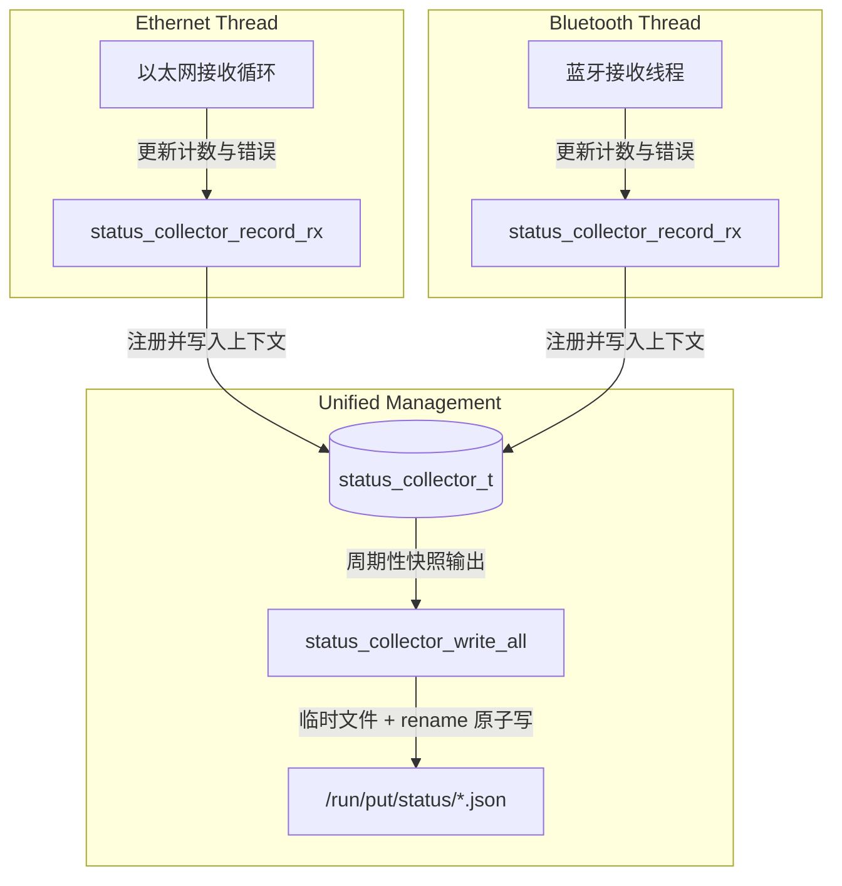

# 蓝牙模块设计说明书

## 1. 模块定位与背景

在多协议 anyMSG 网关项目中，大核 Linux 侧（基于 Milk-V Duo 256M 平台）除了负责高速的以太网 UDP 调试帧通信外，还需要接入**经典蓝牙 SPP (Serial Port Profile)** 通信模块。该模块作为网关的无线本地调试与车辆控制入口，允许手机 App 或手持调试设备通过经典蓝牙配对，向网关发送控制指令，进而转换为大小核 IPC 帧（v1 架构填充为 `unified_frame_t`，后续升级为 v2 架构填充为完整 anyMSG 帧），最终下发到车辆网络。

### 1.1 设计目标
1.  **高性能与实时性**：采用多线程（Pthread）异步架构，蓝牙接收与解析独立运行，不阻塞以太网主线程或系统的其他核心流程。
2.  **高可靠性与强容错**：支持断线自动重连，具备强大的数据帧边界校验（CRC-16 校验与 DLC 过滤），并能有效防御数据流在无线传输中的黏包和分包问题。
3.  **零编译依赖**：不强依赖外部 BlueZ 动态链接库或繁琐的头文件。通过自定义 Linux 内核蓝牙 RFCOMM 协议结构体，实现在任何交叉编译工具链下的“零门槛、一次编译通过”。
4.  **多线程安全状态上报**：与全局其他物理适配器共同遵守一套由全局互斥锁保护的集中式状态收集机制（`status_collector_t`），在子线程高频汇报状态时，保证系统快照的原子性与完整性。

---

## 2. 整体架构与业务流

经典蓝牙模块运行在大核 Linux 系统的独立子线程中。整体业务链条如下：

```text
外部蓝牙调试终端（手机 App/脚本）
      ↓  (经典蓝牙 RFCOMM 链路，Channel 1)
大核蓝牙接收子线程 (bluetooth_server_start)
      ↓  (接收固定 76 字节原始二进制数据)
数据帧校验与解析 (bluetooth_parse_frame)
      ↓  (转化为统一格式帧 unified_frame_t 结构体)
大核到小核 IPC 桩 (ipc_to_rtos_send)
      ↓  (通过共享内存 Ring 发送到小核)
小核 FreeRTOS 路由调度，转发到 CAN 总线
```

### 2.1 集中式状态快照收集机制
为了向 Web 服务（`put-webd`）提供各模块连通性和收发统计，项目引入了统一的**集中式状态收集器 (`status_collector_t`)**。蓝牙线程无需再自行操作全局快照文件或竞争文件锁，而是采用线程安全的指针上下文传递，进行非阻塞的数据上报：



通过该重构，蓝牙线程仅负责通过统一的非阻塞 API 汇报统计指标，从而彻底规避了多线程并发写冲突。

---

## 3. 蓝牙原始二进制帧协议规范

客户端向大核蓝牙 RFCOMM 发送的数据帧采用小端（Little-Endian）字节序。

### 3.1 帧结构定义
每帧固定为 **76 字节**，数据分布如下表：

| 字节偏移 | 字段名称 | 数据类型 | 作用与规范 |
| :--- | :--- | :--- | :--- |
| **0 - 1** | `magic` | `uint16_t` | 固定魔数，恒为 `0x55AA`（用于对齐帧头边界） |
| **2** | `version` | `uint8_t` | 协议版本号，当前恒为 `0x01` |
| **3** | `vehicle_type` | `uint8_t` | 车辆车型标识，传入协议中间消息 |
| **4** | `can_flags` | `uint8_t` | CAN 帧属性属性（SPSC IPC v1 只支持经典 CAN，在此强制禁止 CAN FD 标志） |
| **5** | `can_dlc` | `uint8_t` | CAN 帧实际数据长度。由于共享内存 IPC 冻结为经典 CAN，此处必须严格限制在 `0 - 8` |
| **6 - 9** | `can_id` | `uint32_t` | 目标 CAN ID（小端） |
| **10 - 73** | `can_data` | `uint8_t[64]` | CAN 帧负载数据（物理接收保留 64 字节以对齐外设规格，但在当前经典 CAN 限制下，只有前 8 字节有效） |
| **74 - 75** | `crc16` | `uint16_t` | 帧头+帧负载（0到73字节）的 CRC-16-CCITT 校验码 |

---

## 4. 核心接口与数据结构定义

为了规范大核与蓝牙物理接口之间的交互，蓝牙模块向主控框架暴露了如下的抽象接口与追踪结构体。

### 4.1 蓝牙状态追踪结构体 (`bluetooth_status_t`)
维护蓝牙的流式收发计数、网络连接状态以及最近的报错事件元数据：

```c
typedef struct {
    bool enabled;                     /* 是否开启状态输出 */
    bool listening;                   /* 蓝牙 Socket 是否处于监听状态 */
    bool connected;                   /* 是否存在客户端连接 */
    bool stopped;                     /* 蓝牙服务线程是否已停止 */
    uint8_t rfcomm_channel;           /* 绑定的 RFCOMM 通道 (默认为 1) */
    char status_dir[256];             /* 状态快照保存的目录 */

    uint64_t rx_count;                /* 成功接收到的原始数据包数 */
    uint64_t tx_count;                /* 成功解析并打包转发到小核的帧数 */
    uint64_t rx_bytes;                /* 累计接收的字节数 */
    uint64_t error_count;             /* 累计总错误数 */
    uint64_t parse_error_count;       /* 解析失败计数 */
    uint64_t pack_error_count;        /* 统一帧打包失败计数 */
    uint64_t ipc_error_count;         /* 发送到小核失败计数 */
    uint64_t consecutive_error_count; /* 连续发生异常的次数（用于诊断故障） */

    uint64_t started_at_ms;           /* 蓝牙服务线程启动时间戳 */
    uint64_t updated_at_ms;           /* 快照最近更新时间戳 */
    uint64_t last_seen_ms;            /* 最近一次成功接收数据的时间戳 */
    uint64_t last_tx_ms;              /* 最近一次成功发送 IPC 的时间戳 */
    
    char connected_client_addr[128];  /* 当前配对连接的客户端 MAC 物理地址 */
    char last_error_stage[128];       /* 发生最近一次异常的阶段 (如 "recv", "parse") */
    char last_error_message[128];     /* 最近一次报错信息描述 */
} bluetooth_status_t;
```

### 4.2 核心管理与解析接口

#### ① 启动蓝牙服务子线程
```c
/**
 * @brief 启动大核蓝牙服务监听子线程（异步脱离）
 * @param collector 全局集中式状态收集器指针
 * @return 0 启动成功，-1 启动失败
 */
int bluetooth_server_start(status_collector_t *collector);
```
*   **核心行为**：此接口会被大核的 `main.c` 在启动阶段调用，在后台创建并脱离（detach）一个 Pthread，独立处理经典蓝牙的 Socket 绑定、监听与连接阻塞轮询。

#### ② 优雅停止蓝牙服务
```c
/**
 * @brief 优雅停止蓝牙监听服务，关闭套接字并销毁子线程资源
 */
void bluetooth_server_stop(void);
```
*   **核心行为**：将运行标志置为 false，并对当前监听套接字与客户端套接字执行 `shutdown` 与 `close`。这会强制阻塞中的 `accept` 或 `recv` 系统调用立即返回，使得蓝牙线程能平滑地退出循环并释放系统资源。

#### ③ 原始数据帧边界校验与解析
```c
/**
 * @brief 解析并校验大核蓝牙接收到的原始 76 字节二进制帧
 * @param buffer 输入字节缓冲区
 * @param length 数据流长度
 * @param out_msg 输出的协议解析中间消息结构
 * @return UNIFIED_OK 表示校验且解析成功，否则返回对应的错误码
 */
unified_error_t bluetooth_parse_frame(const uint8_t *buffer,
                                      size_t length,
                                      protocol_parsed_msg_t *out_msg);
```
*   **核心行为**：对输入长度进行硬对齐检验（必须等于 76 字节），校验魔数 `0x55AA` 及 CRC-16-CCITT，并在接收端拦截 `can_dlc > 8` 或带有 FD 标志的不合规经典 CAN 流量。

---

## 5. 统一帧 anyMSG 映射转换设计

蓝牙模块将 76 字节二进制报文校验无误后，转换塞给共享内存 IPC 发送桩。

### 5.1 对接 SPSC IPC v1 的 `unified_frame_t`
当前大小核共享内存 v1 接口基于 `common/include/unified_frame.h` 里的 `unified_frame_t`（固定 96 字节，携带转发元数据）。
蓝牙接收到 76 字节数据包后，转换填充到 `unified_frame_t` 的映射规则如下：

```c
// 统一帧映射转换伪代码
unified_frame_t out_frame;
memset(&out_frame, 0, sizeof(unified_frame_t));

out_frame.magic = 0xAA55;          /* SPSC 统一帧规定魔数 */
out_frame.version = UNIFIED_FRAME_VERSION;
out_frame.protocol_type = 0x03;    /* 协议类型标记，0x03 表示蓝牙源 */
out_frame.vehicle_type = bt_pkt.vehicle_type;
out_frame.can_flags = bt_pkt.can_flags;
out_frame.can_dlc = bt_pkt.can_dlc;
out_frame.can_id = bt_pkt.can_id;

// 将蓝牙包中的 can_data 拷贝到统一帧的数据区（经典 CAN 仅前 8 字节有效）
memcpy(out_frame.can_data, bt_pkt.can_data, 8); 

// 计算统一帧的 CRC-16 并填充（覆盖前 94 字节）
out_frame.crc16 = calculate_crc16((uint8_t*)&out_frame, sizeof(unified_frame_t) - 2);
```

### 5.2 前瞻性设计：面向 SPSC v2 (完整 anyMSG 帧) 的平滑过渡
在系统的长期规划中，大小核共享内存将升级为 **v2 Frame Pool 模式**，直接搬运完整可变长度的 `anyMSG`。
为了避免后续重构导致蓝牙模块大改，解析接口设计必须遵循**输入解析与封装转换解耦**的原则：
*   **输入解析**：由 `bluetooth_parse_frame` 将原始 76 字节解析输出到中间体 `protocol_parsed_msg_t`。
*   **封装转换**：由 `frame_packer_pack(const protocol_parsed_msg_t *in, unified_frame_t *out)` 集中处理。后续升级到 anyMSG v2 时，仅需更换 `frame_packer_pack` 实现为封装 `anyMSG` 头格式，即可实现蓝牙业务层零改动。

---

## 6. 关键设计细节与防错机制

### 6.1 无线信道下的流式黏包防御
由于经典蓝牙 Socket 采用基于 TCP 思想的 RFCOMM 字节流协议，在空中信号差、强干扰的环境下，底层的分片和重传会导致 `recv()` 产生截断（分包）或者多个帧拼接在一起（黏包）的问题。
*   **解决机制**：采用阻塞重入的 `recv_all(int fd, uint8_t *buf, size_t target)` 精准边界防御机制，通过 `while` 循环累加读取字节直至等于目标字节数，确保每次提取的数据段都精准地对齐在 **76 字节** 边界上，绝不引发滑窗解析错位。

### 6.2 零依赖的 Linux 蓝牙底层适配
为了能够规避繁重的 BlueZ 协议栈头文件（`<bluetooth/bluetooth.h>` 和 `<bluetooth/rfcomm.h>`）编译依赖，大核蓝牙模块在实现时自主还原并封装了底层的协议常量与地址结构体：
```c
#define AF_BLUETOOTH 31
#define BTPROTO_RFCOMM 3

struct sockaddr_rc {
    sa_family_t rc_family;
    uint8_t     rc_bdaddr[6]; // 客户端 6 字节 MAC 地址
    uint8_t     rc_channel;
};
```
该段代码经过多次静态评估，完美兼容 RISC-V 64 GNU/Musl 交叉编译链，具备极强的跨编译平台移植能力。

### 6.3 线程级生命周期及上下文管理
大核应用中的所有协议接收线程（以太网、RS485、蓝牙）其生命周期均由协议管理器 `protocol_manager` 统一管理。
*   **生命周期绑定**：当某子线程检测到外部中断或调用 `bluetooth_server_stop()` 平滑自毁时，会自动修改状态收集上下文中的模块状态为停止并说明故障原因。
*   **防止野指针与崩溃**：状态收集器采用完全基于全局只读快照的设计，子线程不直接操作文件，所有数据读写均通过安全的指针上下文传递。即使子线程意外崩溃退出，主框架的状态收集引擎仍能安全隔离故障，避免悬空指针引发网关程序发生 **Segmentation Fault** 的风险。

---

## 7. 故障恢复与 Fail-safe 机制设计

1.  **断线自动重连**：当 `recv_all` 检测到客户端断开时，蓝牙线程绝不能崩溃。蓝牙工作循环中采用**双重循环结构**，内层循环处理当前配对套接字，一旦异常退出，外层循环会自动关闭当前的临时 `client_fd` 并重新进入监听与 `accept` 状态，实现无缝断线自动重连。
2.  **严格拦截脏报文**：大核端是系统安全的第一道屏障。对于任何 Magic 错、CRC16 校验错误、DLC > 8 的报文，蓝牙模块必须**直接舍弃**，防止其进入共享内存污染小核路由队列，确保车载总线不受非法帧冲击。
3.  **发送 IPC 失败处理**：当小核队列满导致 `ipc_to_rtos_send` 返回 `UNIFIED_ERR_IPC_QUEUE_FULL` 时，说明小核处理发生积压。蓝牙线程应调用快照上报接口记录事件，并以合理的策略（如丢弃本调试帧，保护高优先级控制帧）释放资源，绝不能无限阻塞蓝牙套接字。
