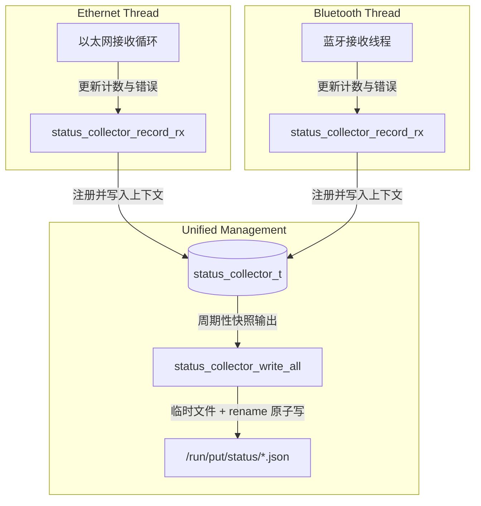

# 蓝牙模块设计说明书 (v2 anyMSG 架构)

## 1. 模块定位与背景    

在多协议 anyMSG 网关项目中，大核 Linux 侧（基于 Milk-V Duo 256M 平台）除了负责高速的以太网通信外，还需要接入**经典蓝牙 SPP (Serial Port Profile)** 通信模块。该模块作为网关的无线本地调试与车辆控制入口，允许手机 App、手持调试设备或外部蓝牙调试终端通过经典蓝牙配对，向网关发送符合 **anyMSG 协议** 的数据帧。

### 1.1 设计目标
1.  **全面适配 anyMSG v2 架构**：蓝牙模块不再作为局限的“蓝牙-CAN直传”通道，而是作为 one of the six 物理通道，以完整的 `anyMSG` 帧作为唯一业务载荷实体，传输和路由完全解耦。
2.  **高性能与实时性**：采用多线程（Pthread）异步架构，蓝牙接收与协议栈切帧在独立线程中运行，不阻塞主线程。
3.  **高可靠性与强容错**：支持物理链路断线自动重连，具备强大的流式切帧容错，拦截非法与损坏数据，不污染小核路由队列。
4.  **接口抽象一致性**：适配全局统一的 `physical_interface_adapter_t` 接口，使蓝牙与其他五类物理接口（CAN、以太网、Wi-Fi、4G、RS485）在协议管理器（`protocol_manager`）下具有统一的行为特征。
5.  **零编译依赖**：通过自定义 Linux 内核蓝牙 RFCOMM 协议结构体，无需依赖外部 BlueZ 动态链接库，实现在任何交叉编译工具链下的“零门槛、一次编译通过”。
6.  **多线程安全状态上报**：与全局其他物理适配器共同遵守一套由全局互斥锁保护的集中式状态收集机制（`status_collector_t`），在子线程高频汇报状态时，保证系统快照的原子性与完整性。

---

## 2. 整体架构与业务流

经典蓝牙模块运行在大核 Linux 系统的独立子线程中，并被封装为统一的物理适配器实体。其整体接收和发送业务链条如下：

### 2.1 接收数据流 (RX Path)
```text
外部蓝牙调试终端 (手机 App / 调试脚本)
      ↓ (经典蓝牙 RFCOMM 链路，Channel 1，承载 complete anyMSG 帧 / 分片)
大核蓝牙接收子线程 (bluetooth_adapter 独立接收循环)
      ↓ (基于 anyMSG msg_length 动态切帧，提取出完整 anyMSG 字节流)
适配器 decode_rx 与 reassemble 校验
      ↓ (Linux 侧分配共享内存 Frame Pool 内存块，写入完整 anyMSG 帧)
大核写共享内存蓝牙 RX Ring 描述符
      ↓ (设置 rx_pending_bitmap 并发送 Mailbox Doorbell 唤醒小核)
小核 FreeRTOS 路由调度 (根据 destination_cid 转发到目标接口，如 CAN)
```

### 2.2 发送数据流 (TX Path)
```text
小核路由决策完毕，写入共享内存蓝牙 TX Ring 描述符
      ↓ (设置 tx_pending_bitmap 并发送 Mailbox Doorbell 唤醒 Linux)
Linux 蓝牙出口执行单元 (从 Frame Pool 读取完整 anyMSG)
      ↓ (若 anyMSG 长度超出物理 MTU，则通过 fragment_tx 转换为分片)
蓝牙适配器 encapsulate 封包并发送
      ↓ (通过 RFCOMM 真实发送给外部蓝牙终端)
Linux 释放 Frame Pool 中已发送的帧 block
```

### 2.3 集中式状态快照收集机制
为了向 Web 服务（`put-webd`）提供各模块连通性和收发统计，项目引入了统一的**集中式状态收集器 (`status_collector_t`)**。蓝牙线程无需再自行操作全局快照文件或竞争文件锁，而是采用线程安全的指针上下文传递，进行非阻塞的数据上报：



通过该重构，蓝牙线程仅负责通过统一的非阻塞 API 汇报统计指标，从而彻底规避了多线程并发写冲突。

---

## 3. 蓝牙载荷协议与寻址路由规范

### 3.1 物理载荷定义
外部蓝牙调试终端与网关大核蓝牙之间通过经典蓝牙 RFCOMM 传输的数据，采用 **anyMSG 统一数据帧格式**（符合《统一数据帧设计.md》规范）。
* anyMSG 帧由 40 字节固定帧头与可变长度 Payload 组成。
* 单帧大小范围：`40 字节` 至 `512 字节`（受 v2 共享内存单 frame_buffer 的 512B 限制）。

### 3.2 寻址路由规范 (CID)
在 anyMSG 帧头中：
* **Source CID**（源通信地址）：蓝牙调试终端的 `source_cid` 首字节必须属于蓝牙设备段 `0x80 ~ 0x9F`（例如，分配主调试 App 的 CID 为 `0x80000001`）。
* **Destination CID**（目的通信地址）：必须属于已定义的设备段。例如，若需向 CAN 总线上的某个节点发帧，其 `destination_cid` 首字节应属于 CAN 设备段 `0x20 ~ 0x3F`。
* **Payload Type**（类型）：根据业务需求填充。如果是 RAW CAN 帧，`type` 填充为 `0x49`，payload 字段填充 8 字节经典 CAN 数据；如果是 Modbus 业务，`type` 填充为 `0x47`，以此实现真正的跨物理接口路由。

---

## 4. 统一物理接口适配器适配设计

为了融入网关的统一接口管理，蓝牙模块将所有的生命周期、状态收集和收发控制逻辑封装为 `physical_interface_adapter_t` 接口表的实现：

```c
/* 蓝牙适配器声明，对外暴露至 protocol_manager */
extern physical_interface_adapter_t bluetooth_adapter;
```

### 4.1 蓝牙物理接口适配器实现结构
在 `linux_app/adapters/bluetooth_adapter.c` 中，接口表的具体填充如下：

```c
physical_interface_adapter_t bluetooth_adapter = {
    .name = "Bluetooth",
    .interface_id = 0x03,                         /* 蓝牙接口统一 ID */
    .get_mtu = bluetooth_get_mtu,
    .decode_rx = bluetooth_decode_rx,
    .reassemble = bluetooth_reassemble,
    .encapsulate = bluetooth_encapsulate,
    .fragment_tx = bluetooth_fragment_tx,
    .send = bluetooth_send,
    .status = bluetooth_get_status
};
```

---

## 5. 核心接口与数据结构定义

### 5.1 蓝牙状态追踪结构体 (`bluetooth_status_t`)
维护蓝牙的流式收发计数、网络连接状态以及最近的报错事件元数据：

```c
typedef struct {
    bool enabled;                     /* 是否开启状态输出 */
    bool listening;                   /* 蓝牙 Socket 是否处于监听状态 */
    bool connected;                   /* 是否存在客户端连接 */
    bool stopped;                     /* 蓝牙服务线程是否已停止 */
    uint8_t rfcomm_channel;           /* 绑定的 RFCOMM 通道 (默认为 1) */
    char status_dir[256];             /* 状态快照保存的目录 */

    uint64_t rx_count;                /* 成功接收到的完整 anyMSG 帧数 */
    uint64_t tx_count;                /* 成功发送给外部调试终端的帧数 */
    uint64_t rx_bytes;                /* 累计接收的字节数 */
    uint64_t error_count;             /* 累计总错误数 */
    uint64_t parse_error_count;       /* 帧解析/切帧失败计数 */
    uint64_t shm_alloc_fail;          /* 共享内存 Frame Pool 申请失败计数 */
    uint64_t ipc_error_count;         /* 写入大小核 IPC Ring 失败计数 */
    uint64_t consecutive_error_count; /* 连续发生异常的次数（用于诊断故障） */

    uint64_t started_at_ms;           /* 蓝牙服务线程启动时间戳 */
    uint64_t updated_at_ms;           /* 快照最近更新时间戳 */
    uint64_t last_seen_ms;            /* 最近一次成功接收数据的时间戳 */
    uint64_t last_tx_ms;              /* 最近一次成功发送 IPC 的时间戳 */
    
    char connected_client_addr[128];  /* 当前配对连接的客户端 MAC 物理地址 */
    char last_error_stage[128];       /* 发生最近一次异常的阶段 (如 "recv", "parse") */
    char last_error_message[128];     /* 最近一次报错信息描述 */
} bluetooth_status_t;
```

### 5.2 核心管理与适配器实现函数

#### ① 启动与停止管理
```c
/**
 * @brief 启动大核蓝牙服务监听子线程（异步脱离）并注册至全局状态收集器
 * @param collector 全局集中式状态收集器指针
 * @return 0 启动成功，-1 启动失败
 */
int bluetooth_server_start(status_collector_t *collector);

/**
 * @brief 优雅停止蓝牙监听服务，关闭套接字并销毁子线程资源
 */
void bluetooth_server_stop(void);
```

#### ② 适配器接口实现函数
```c
/**
 * @brief 从物理缓冲区解析 complete anyMSG
 * @param ctx 蓝牙私有上下文指针
 * @param input 原始字节数据
 * @param input_len 数据长度
 * @param out 解析及校验结果
 * @return 0 成功，非 0 为错误码
 */
int bluetooth_decode_rx(void *ctx, const uint8_t *input, size_t input_len, adapter_rx_result_t *out);

/**
 * @brief 从共享内存 Frame Pool 发送数据包
 * @param ctx 蓝牙私有上下文指针
 * @param packet 待发送 of 物理包封装
 * @return 0 发送成功，非 0 失败
 */
int bluetooth_send(void *ctx, const adapter_tx_packet_t *packet);
```

---

## 6. 关键设计细节与防错机制

### 6.1 无线流式链路下的“动态长度切帧防御”
由于经典蓝牙 SPP (RFCOMM) 是基于字节流的可靠协议，在空中信号强干扰环境下会频繁出现“黏包”与“分包”问题。
*   **解决机制**：放弃固定 76 字节接收设计，采用**动态两阶段阻塞接收 (`recv_all`)** 机制：
    1.  **第一阶段**：从 Socket 阻塞读取前 2 字节（即 anyMSG 的 `msg_length` 字段）。
    2.  **校验长度边界**：验证 `msg_length` 是否在 `40` 到 `512` 字节范围内。若不符合，说明数据流对齐已损坏，立即关闭套接字并断线重连，防止脏流影响后续解析。
    3.  **第二阶段**：根据解析出的 `msg_length`，精准读取后续的 `msg_length - 2` 字节，彻底拼装出一条完整的 anyMSG 帧，绝不引发滑窗错位。

```c
// 两阶段流式切帧伪代码
uint16_t msg_length = 0;
if (recv_all(client_fd, (uint8_t*)&msg_length, 2) != 2) {
    // 错误处理，自动断开
}
msg_length = le16toh(msg_length); // 小端转换
if (msg_length < 40 || msg_length > 512) {
    // 严重对齐错误，断开重连并记录
    bluetooth_handle_disconnect();
}

uint8_t frame_buffer[512];
*(uint16_t*)frame_buffer = htole16(msg_length);
if (recv_all(client_fd, frame_buffer + 2, msg_length - 2) != (msg_length - 2)) {
    // 读剩余字节失败，处理断线
}
// 此时 frame_buffer 包含完整 anyMSG 帧，可安全交付 decode_rx 校验
```

### 6.2 大大小核 IPC v2 深度融合与 Frame Pool 分配
蓝牙模块接收到完整 anyMSG 字节流并经适配器 `decode_rx` 验证合法后：
1.  **申请内存块**：调用 `linux_shm_ipc_alloc()` 在共享内存的 **Frame Pool** 动态分配一个 block。
2.  **写入业务数据**：将 complete anyMSG 直接 memcpy 塞入该 block。
3.  **封包描述符**：在大核侧封装一个 64 字节的 **Descriptor**，将 `frame_id`、`frame_length`、`source_cid` 等元数据填入，写入蓝牙的 **Descriptor RX Ring**。
4.  **原子通知**：平台原子置位 `rx_pending_bitmap`，当 Ring 状态从 empty 变为 non-empty 时，通过 Mailbox Doorbell 硬件中断唤醒小核。

### 6.3 零依赖的 Linux 蓝牙底层适配
为了能够规避繁重的 BlueZ 协议栈头文件编译依赖，大核蓝牙模块在实现时自主还原并封装了底层的协议常量与地址结构体：
```c
#define AF_BLUETOOTH 31
#define BTPROTO_RFCOMM 3

struct sockaddr_rc {
    sa_family_t rc_family;
    uint8_t     rc_bdaddr[6]; // 客户端 6 字节 MAC 地址
    uint8_t     rc_channel;
};
```
该段代码经过多次静态评估，完美兼容 RISC-V 64 GNU/Musl 交叉编译链，具备极强的跨编译平台移植能力。

---

## 7. 故障恢复与 Fail-safe 机制设计

1.  **断线自动重连**：当流式对齐损坏或 `recv_all` 检测到客户端断开时，蓝牙线程绝不能崩溃。蓝牙工作循环中采用**双重循环结构**，内层循环处理当前配对套接字，一旦异常退出，外层循环会自动关闭当前的临时 `client_fd` 并重新进入监听与 `accept` 状态，实现无缝断线自动重连。
2.  **严格拦截脏报文**：大核端是系统安全的第一道防御线。对于任何 anyMSG 长度校验错误、保留字段非 0、源 / 目的 CID 首字节不符合规范的报文，蓝牙模块适配层必须**直接舍弃**，防止其进入共享内存污染小核路由队列，确保车载总线不受非法帧冲击。
3.  **发送 IPC 失败处理**：当共享内存 Ring 满（例如 Frame Pool 耗尽，`shm_alloc_fail`）或 `linux_shm_ipc_enqueue` 失败时，表明小核处理发生积压。蓝牙线程应调用快照上报接口记录事件，并以合理的策略（如丢弃本调试帧，保护高优先级控制帧）释放资源，绝不能无限阻塞蓝牙套接字。
